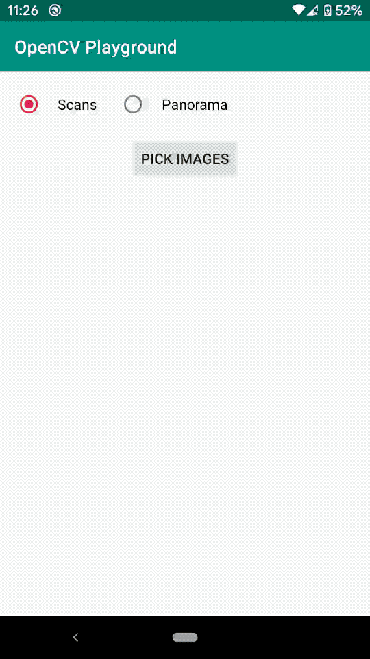

## JavaCV/OpenCV Playground for Android. Image Stitching (Panorama)
The project contains a sample code for image stitching using [JavaCV](https://github.com/bytedeco/javacv) library. Test images can be found in [test images](test%20images) folder.

## Preview

